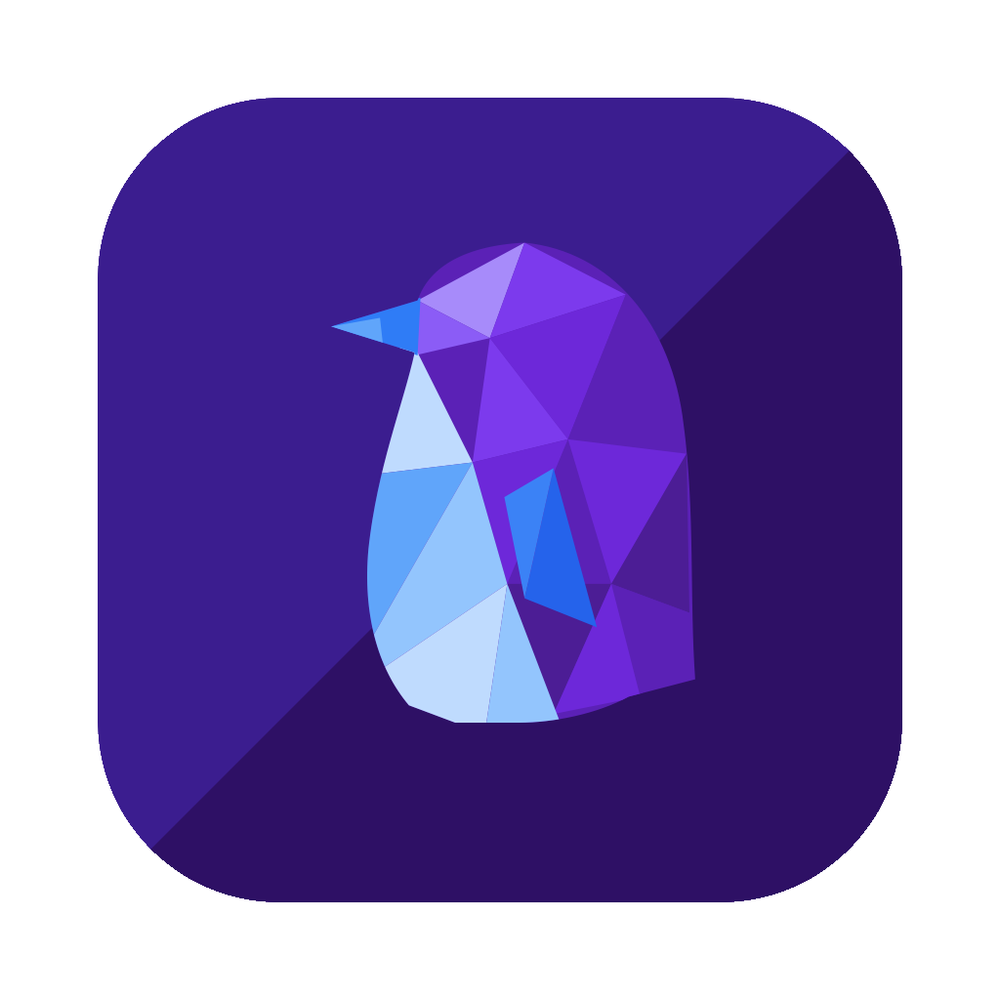

<div align="center">



# echo

A custom Matrix client for macOS, based on [gomuks](https://github.com/gomuks/gomuks).

[](https://github.com/taylorbird/echo/releases/latest)
[](https://github.com/taylorbird/echo/releases/latest)
[](LICENSE)

</div>

---

echo is a [Matrix](https://matrix.org) client built on [gomuks](https://github.com/gomuks/gomuks),
wrapped as a native macOS app with a redesigned interface: native window vibrancy, a rebuilt room
list and space dashboard, a Cmd-K quick switcher, inline link previews, and a settings page that
reads like a Mac app instead of a config file.

It is a real desktop app, not a browser tab — the Matrix client runs locally on your machine and
talks to your homeserver directly.

## Install

Download the latest `.dmg` from **[Releases](https://github.com/taylorbird/echo/releases/latest)**,
open it, and drag **echo** to your Applications folder.

The app is signed with a Developer ID and notarized by Apple, so it opens normally — no
right-click-to-open, no Gatekeeper warning.

**Requirements**

| | |
|---|---|
| Mac | Apple Silicon (M1 or later). Intel Macs are not supported yet. |
| macOS | 13 Ventura or later recommended |
| Account | An existing account on any Matrix homeserver |

echo does not create Matrix accounts. Sign in with an account you already have — from
[matrix.org](https://matrix.org) or any other homeserver.

## Updates

echo updates itself. It checks for a new version each time it launches; when one is ready you get
a **Restart** button in the header, and clicking it relaunches into the new version. Updates are
signed, and a release with a bad signature is refused.

## Where your data lives

Everything stays on your Mac. There is no echo server, no telemetry, and no account with us.

```
~/Library/Application Support/dev.tbird.echo/   config + message database
~/Library/Caches/dev.tbird.echo/                cache
~/Library/Logs/dev.tbird.echo/                  logs
```

Your Matrix session and decrypted message history live in `gomuks.db` in the first directory.
Deleting that folder signs you out and removes local history.

The app runs a local backend on `127.0.0.1:29325`, bound to loopback — nothing on your network can
reach it. It is authenticated automatically; you are never asked for a second password.

## Beta notes

echo is early. Things that are known-rough:

- Apple Silicon only — no Intel or universal build yet
- macOS only — iOS and Android are planned but not started
- No automated release testing yet; each build is verified by hand

Found something broken? [Open an issue](https://github.com/taylorbird/echo/issues) with your macOS
version and what you were doing.

## Building from source

Requires Go, Node, and Rust.

```sh
git clone https://github.com/taylorbird/echo.git
cd echo/web
npm install
npm run tauri dev
```

Debug builds keep their own profile (`dev.tbird.echo-dev`), so running from source never touches
the data of an installed copy.

For a production build, the step order is load-bearing — the Go sidecar embeds `web/dist`, so the
frontend must be built first:

```sh
cd web && npm run build
cd .. && go build -tags goolm -o web/src-tauri/binaries/gomuks-aarch64-apple-darwin ./cmd/gomuks
cd web && npx tauri build
```

`scripts/release.sh` does all of this, plus signing, notarization, and publishing.

## Built on gomuks

echo is a fork of [gomuks](https://github.com/gomuks/gomuks) by
[Tulir Asokan](https://github.com/tulir) — the Matrix client, its crypto, and the Go backend are
gomuks' work. echo adds the macOS app shell and a redesigned frontend.

Licensed under [AGPL-3.0](LICENSE), the same as upstream.
